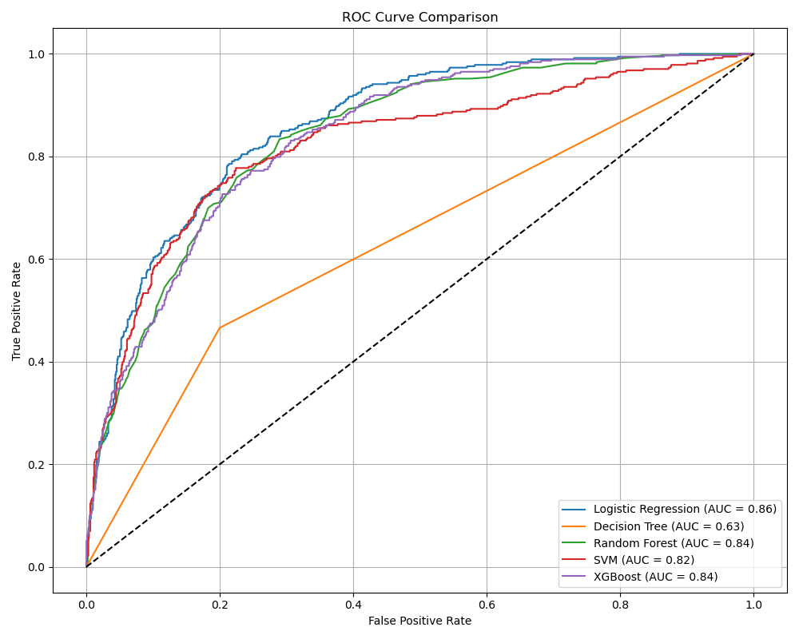
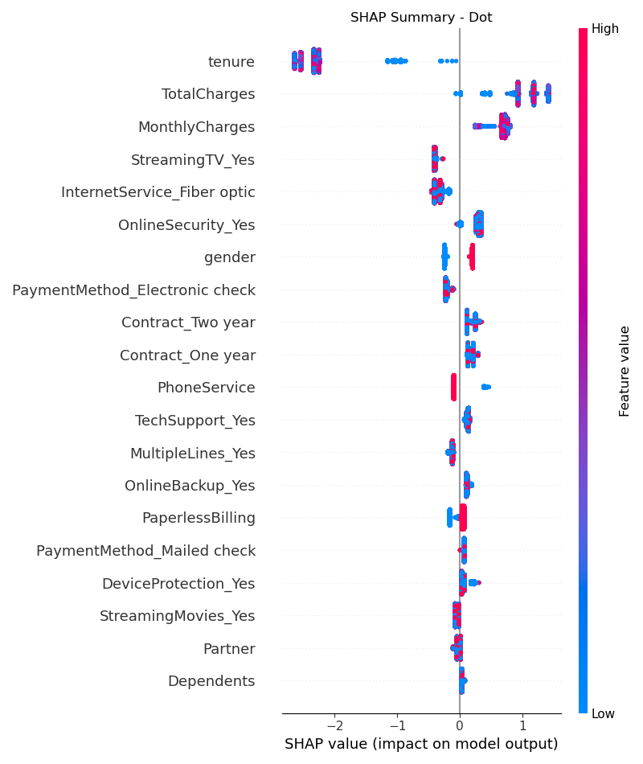

# 📊 Customer Churn Prediction

Predicting customer churn using traditional and ensemble machine learning models with feature importance analysis and explainability (SHAP). This project demonstrates the end-to-end ML lifecycle: data preprocessing, EDA, model training, evaluation, model saving, and visualization.

---

## 🚀 Project Overview

Customer churn is a critical problem in many industries, especially telecom and SaaS. In this project, we:

* Process customer data to prepare it for modeling
* Explore and visualize patterns in churn behavior
* Train multiple ML models (Logistic Regression, Decision Tree, Random Forest, SVM, XGBoost)
* Evaluate models using classification metrics and ROC-AUC
* Visualize feature importance using SHAP and Random Forest
* Save all trained models for future inference

---

## 📁 Project Structure

```
customer-churn-prediction/
│
├── data/
│   └── churn_data.csv
│
├── notebooks/
│   └── churn_prediction.ipynb     # Main analysis and model notebook
│
├── models/
│   └── *.pkl                      # Saved ML models
│
├── outputs/
│   └── plots/                     # ROC curves, feature importance, SHAP plots
│
├── README.md
└── requirements.txt
```

---

## 📌 Features

* Preprocessing: One-hot encoding, scaling, handling missing values
* EDA: Correlation heatmap, churn distribution, categorical analysis
* Modeling: Logistic Regression, Decision Tree, Random Forest, SVM, XGBoost
* Evaluation: Accuracy, Confusion Matrix, Classification Report, ROC-AUC
* Visualization:

  * ROC Curve comparison for all models
  * Random Forest feature importance
  * SHAP summary plots (bar and dot)
* Model saving using `joblib`

---

## 📊 Algorithms Used

| Model               | Description                                       |
| ------------------- | ------------------------------------------------- |
| Logistic Regression | Baseline linear model                             |
| Decision Tree       | Simple tree-based classification                  |
| Random Forest       | Ensemble model to reduce overfitting              |
| SVM                 | Non-linear classifier using hyperplanes           |
| XGBoost             | Gradient boosting model optimized for performance |

---

## 📈 Evaluation Metrics

Each model is evaluated on:

* Accuracy
* Confusion Matrix
* Precision, Recall, F1-score
* ROC Curve and AUC Score

Example ROC Curve Comparison:


---

## 🧠 Explainability with SHAP

SHAP provides insights into model predictions by explaining feature contributions.

* **SHAP Bar Summary**:
  

* **SHAP Dot Summary**:
  

---

## 💾 Model Saving

All trained models are saved into the `models/` directory using `joblib` for reuse or deployment.

---

## 🛠️ Installation

```bash
pip install -r requirements.txt
```

---

## ▶️ How to Run

1. Clone the repository:

```bash
git clone https://github.com/Meghanayalam/customer-churn-prediction.git
cd customer-churn-prediction
```

2. Run the Jupyter Notebook:

```bash
jupyter notebook notebooks/churn_prediction.ipynb
```

3. Explore the outputs in the `outputs/plots/` and `models/` folders.

---

## 📚 Requirements

* pandas
* numpy
* matplotlib
* seaborn
* scikit-learn
* xgboost
* shap
* joblib

---

## 📌 License

This project is licensed under the MIT License.

---

